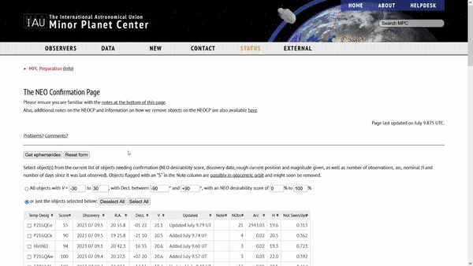

# MPCS :comet:

[](https://forthebadge.com) [](https://forthebadge.com)

  

A desktop program for solving the Minor Planet Center uncertainty maps of near Earth objects (NEOs) :star2:

---

# Table of contents

 - [The Purpose](#the-purpose)
 - [Requirements](#requirements)
 - [How to use](#how-to-use)
    - [Getting the data](#getting-the-data)
    - [Running the program](#running-the-program)
    - [Extracting data](#extracting-data)
 - [Configuring](#configuring)
 - [Installing from binary](#installing-from-the-binary)
 - [Building from source](#building-from-source)
    - [Installing from source](#installing-from-source)
 - [Dependencies](#dependencies)
 - [License](#license)
 - [The future](#the-future)

# The purpose
MPCS is a program created to simplify the interactions between the official [Minor planet center](https://www.minorplanetcenter.net/iau/NEO/toconfirm_tabular.html) website for NEO objects and systems using it

In short, you provide the object you want to observe to the program and it displays its uncertainty map to you, the map is interactive so you can click on it and the picture location coordinates for the telescope will get calculated

MPCS stands for Minor Planet Center Solver

:telescope: This program is used in [Višnjan Observatory](https://en.astro.hr/) and in Farra Observatory :telescope:

Please do note that as of right now, this program is largely untested on linux and mac but dont hesitate to get in touch if you want to try using it in your observatory, we can easily figure something out

# Requirements
**For running:** a computer that's preferably from this century but it may be fine if its not

**For building:** C++ compiler, a buildsystem (for example mingw), [CMake](https://cmake.org/) version 3.24 or higher, [git](https://git-scm.com/), and [NSIS2](https://nsis.sourceforge.io/Main_Page) (optional)

If you are building on a Windows machine, using [MSYS2](https://www.msys2.org/) to get the compiler and the build system is highly recommended.

# How to use
MPCS was made to be simple to use, so yeah, there's that
## Getting the data
Go to [the NEO index](https://www.minorplanetcenter.net/iau/NEO/toconfirm_tabular.html), pick the objects and insert your position. Then click on "Get ephemerides"

[](docs/obtain.gif)

You will be prompted with a bunch of objects and their offsets, pick the one you want to observe at the desired time and copy its offsets link

[](docs/copy.gif)

## Running the program
Just... run the MPCS executable

**Running MPCS from the terminal**

If you choose to run it from the terminal, make sure you are in its directory, otherwise it will not be able to reach the data it needs access to

Its also worth noting that MPCS can be ran with arguments from the command line, you can get the list of arguments by running `MPCS --help`

## Extracting data

When MPCS runs it will ask you for the data about the object you want to observe, which includes the offsets URL, exposure of the pictures and their amount

When you provide all information you will be prompted with an interactive uncertainty map where you will select the areas you want to take pictures on the map

You can press H and the controls will get printed to the terminal

When you select all areas to take pictures, you should press Q to confirm the selection

[](docs/use.gif)

The observation locations will get printed to the console and copied to the clipboard

# Configuring

You can configure the program in `resources/MPCS.ini`

The parameters you can configure are window height (H), width (W) and the telescope FOV (FOV)

# Installing from the binary
Installing from the binary is as simple as going to the [releases tab](https://github.com/astrohr/MPCS/releases) and downloading the release you want

The wizard :mage: will walk you through the installation, this way you also get a *cool* uninstall executable

Keep in mind that the binary will be located in the `bin` folder of the install location and will be named `MPCS.exe`

# Building from source
**Obtaining the source** :scroll:

`git clone --recursive https://github.com/astrohr/MPCS.git ./MPCS`

^ due to submoduling, it is *crucial* you do a recursive clone

**Building** :gear:

Create the build directory and run the cmake command for generating makefiles
```
mkdir build
cmake -S . -B ./build -G "MinGW Makefiles" -DCMAKE_BUILD_TYPE=Release
```
^ please do note that -G is dependent on the build system that you will use, here its MinGW, you can see all generators by running `cmake --help`

After cmake generates makefiles, run them
```
cd ./build
mingw32-make
```
^ again, mingw is the buildsystem we use

And a fully functional executable should appear in your build folder :smile:

## Installing from source
While just building the program will create a working executable, it is recommended that you finish the installation process by running `cmake --install .` from an elevated terminal inside the build folder, this will populate the directories that are meant to be populated for regular program installation

If, however, you want to export the project outside the system used for building you have two options 

**creating a zip archive of the program**

run `cpack -G ZIP` or `cpack -G TGZ` from the build folder, it will create an archive that you can extract on the desired location

**creating an installer**

running `cpack -G NSIS` should do

^ for this you must have NSIS2 installed

# Dependencies
All of the following dependencies are submoduled in this version, so cloning the repo recursively will include all of the dependencies

Wonderful open source projects that make this project possible:
- [SFML 2.5.x](https://github.com/SFML/SFML/tree/2.5.x)
- [libcurl](https://github.com/curl/curl)
- [fmt](https://github.com/fmtlib/fmt)
- [args](https://github.com/Taywee/args)
- [inipp](https://github.com/mcmtroffaes/inipp)

huge thanks and respect to their devs :heart:

# License
This program is released under the [zlib](https://en.wikipedia.org/wiki/Zlib_License) license

---

# The future
This is MPCS version 2, the work on this branch has ended, however the work still continues on other branches (version 3 as of writing this)

Version 3 aims to be simpler to use, more portable and have a vastly improved functionality, so keep an eye on it! :eyes:

